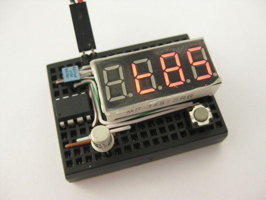
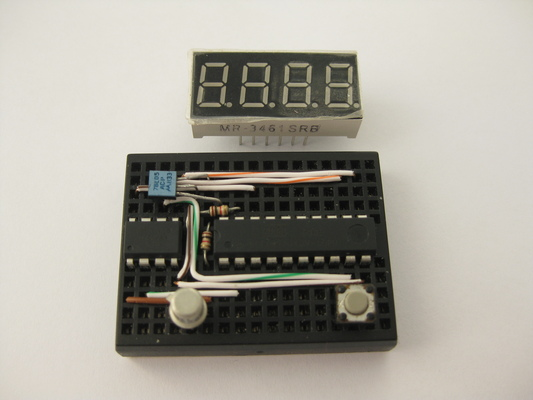
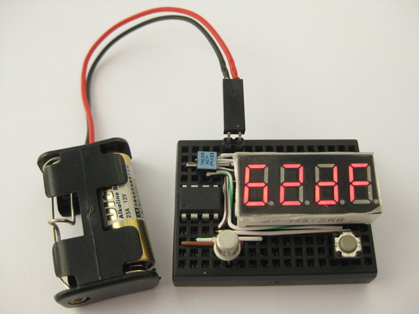
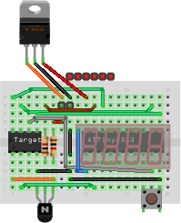
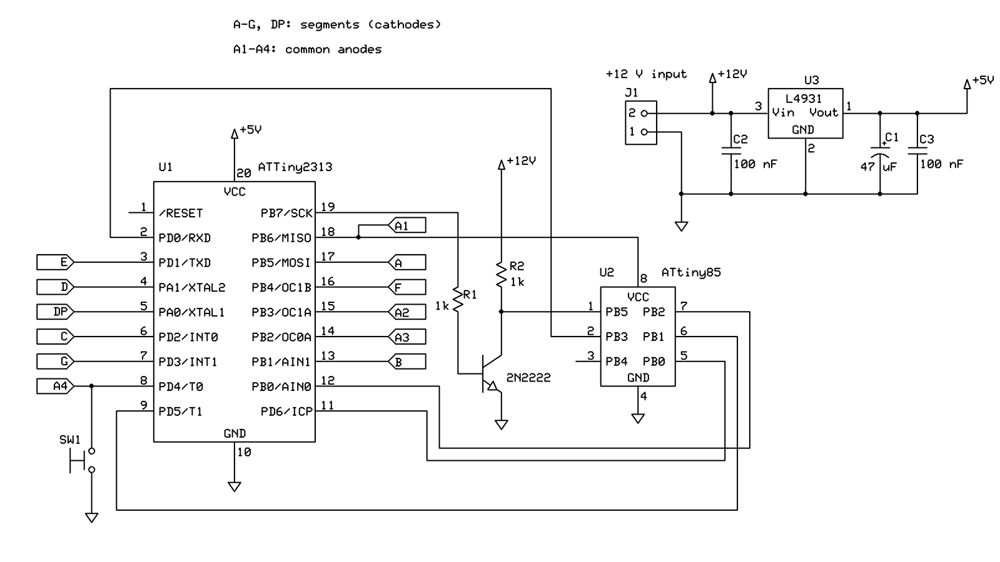
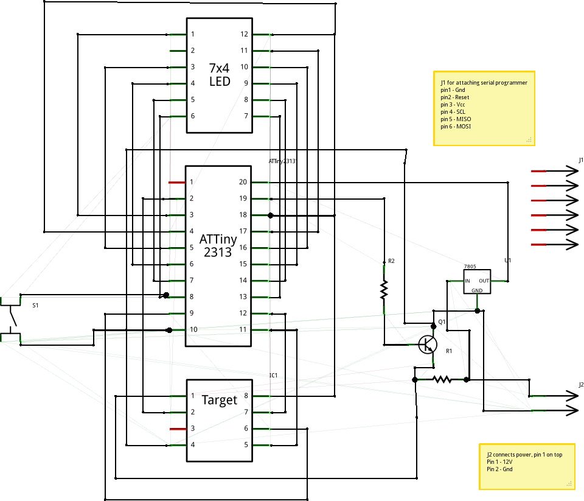
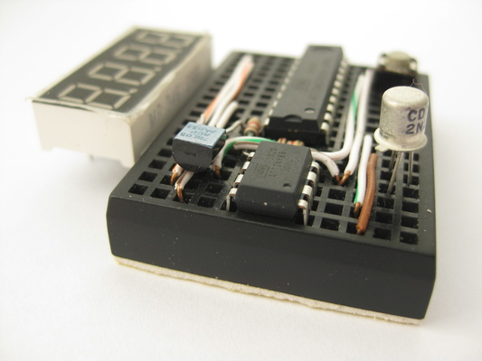

## HVSP Fuse Resetter


`[November, 2010]` Initial write-up.

**Resets Certain AVR devices fuses via High-voltage Programming.**


<iframe width="560" height="315" src="https://www.youtube.com/embed/rHaswi-OYXo" frameborder="0" allow="autoplay; encrypted-media" allowfullscreen></iframe>
<br><br>

 


HVSP fuse resetter probing a target tiny85 device.


### Description


In working w/ 8 or 14 pin avr devices, I would sometimes want to use the RESET pin as io as the io pin count is low. But doing so will disable further programming via SPI. I do not need a full blown HV programmer, just a way to revert these devices to factory default fuse settings so that i can use SPI to flash them again. It is also handy as sometimes by mistake i may burn wrong fuse value and brick my devices.


This project is created so that if i could revert the RESET fuse change and flash via SPI again. It employs the high-voltage serial programming (HVSP) available for such devices. Note that this is not to be confused w/ the high-voltage parallel programming used for 20pin+ devices (i.e. tiny2313, mega8, etc).


### Features


- Reads device signature and hi-low fuses for hi-voltage serial programmable attinys
- Reset hi-low fuses to factory default on target devices
- Layout to drop-on attiny13, attiny25/45/85 8 pin devices targets
- attiny24/44/84 targets needs additional breadboard and jumper wires
- Standalone operations, fuses values show on 7 segment display
- Cannot reset fuse for attiny2313 and atmega devices as they requires hi-voltage parallel programming


### Design Notes


To minimize project component count, the 4 digit led module is directly driven by the 2313's io pins. Neither transistors nor current limiting resistors are used. For more detail implementation notes, Please see my digital alarm clock project. the led driving takes up 12 io pins (4 digits + 7 segments + decimal point).


For HVSP purpose, we need to have 6 io pins from t 2313. We need to supply 5V Vcc, 12V to RESET, SCI (serial clock input), SII (serial instruction input), SDI (serial data input) and SDO (serial data out). For that we employ the rest of the free io pins from the 2313, plus some io pins are shared between led driving and HVSP control.


One single tactile button is used to accept input, This io pin is shared between button input and led driving.


Upon attaching power firmware reads target mcu device signature via AVR's HVSP (High-Voltage Serial Programming) interface. It then look up the device name by matching the device signature. In turn, fuse values (hi, low and extended) are read from device.


Fuse values can then be read by pressing the tactile button, which cycles thru device name and various fuse values in hexidecimal format.


Pressing and holding the tactile button for about one second will instruct firmware to write the factory default fuse value to the target mcu device. after writing, firmware re-reads the new fuse values for display.


At all times a timer interrupt is used to perform led multiplexing. Brightness can only be adjusted by source code change.


I had included the more common device types, source code is provided so that different / additional device can be added to the firmware. Please note that only devices with HVSP support can be used.


The circuit requires a main power of 12V supply, a 78L05 voltage regulator brings a 5V Vcc for the 2313 to operate. A 2n2222 is used to switch on 12V towards the target device's RESET pin when HVSP read / writes are being commenced.


### Project Fuse Setting


```
avrdude -c usbtiny -p t2313 -V -U lfuse:w:0xe4:m -U hfuse:w:0xdf:m -U efuse:w:0xff:m 
```


### Parts List


- attiny2313
- 4x7 segment LED display
- 1k resistor x 2
- 2n2222 NPN transistor or equivalent
- 78L05
- Mini breadboard 170 tiepoints
- +12V battery source


 


### Opearation


- Place 8 pin target device on breadboard
- For 14 pin targets, jumper wire to breadboard
- Apply 12V power
- Display shows device name upon identification
- Press and release button to cycle display content
- Displays device name, fuse hi bits, fuse low bits and fuse extended bits
- Long press and release button to reset fuse to factory default

 


Display showing low and hi fuse in hex


### References and Related Projects


avrdoper ~~http://www.obdev.at/avrusb/avrdoper.html/~~ (link no worky no more)

[mightyohm](http://www.mightyohm.com/blog/2008/09/arduino-based-avr-high-voltage-programmer/)


### Breadboard Layout


 


Some components shown above are restricted by drawing software (fritzing), see actual photo, the phyical layout fits a lot nicer.

The two green pins are to be connected to a 12V power source. I use an A23 12V battery but i can only find a 2xA23 battery holder. You may use whatever is available to you.

The six red pins are approximate locations for an ISP programmer hookup, you will need to connect the 2nd pin (from left) to pin 1 (RESET, blue wire) of the tiny2313 during programming. In-circuit programming is a hit and miss, as our programming pins are connected to many devices. For the least, you need to remove the led module before attempting to program isp fashion. If fails, you need to remove 2313 and have it programmed off circuit.


### Schematic


`[December 21st, 2017]` Rick sent me a correct schematic for the project, where he points out that R. Schenk's schematic has pin

8 of the DUT connected to Vcc but it should be connected to pin 18 of the 2313 (anode 1). Rick was kind enough to provide a corrected schematic (below)


 


`[November 29th, 2016]` A fellow builder R. Schenk had took the time to re-create this correct schematic. R(this schematic has a problem, do not use)


 


`[April 11, 2011]` Thanks tomlut pointed out there is a mistake in the schematic. the npn switch transistor has collector and emitter swapped. please observe that the emitter should be grounded and collector should be connected to the RESET pin of the target device. the following schematic has not been fixed yet.


 


### Assembly


- Follow breadboard layout
- Place 2313 first, then layout wires
- I use ethernet cat-5 wires, more than one wire can share a single tie-point
- Layout tactile button, transistor, voltage regulator and two resistors as directed
- The 4x7 segment led module goes in last, on one side the pins shares the same tie-points that the 2313 also occupies
- Since most io pins are share-purposed, you will have trouble programming the 2313 in circuit. i would program it off circuit and put it back on the breadboard

 


You will need to remove tiny2313 and have it programmed off circuit


 


Trusty 2n2222


 


More physical layout details


### Source Code


~~click to download fuse.c~~

~~click to download makefile~~


I am not detailing the development enviroment here. my setup is avr-gcc under linux. If you have trouble you can also use the following hex files and skip the build


~~click to download fuse.hex~~

~~click to download fuse.ee.hex~~


Source code now reside in [my github repository](https://github.com/simpleavr/old_projects/tree/master/avr_fuse)


