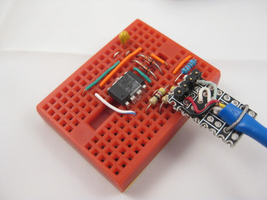
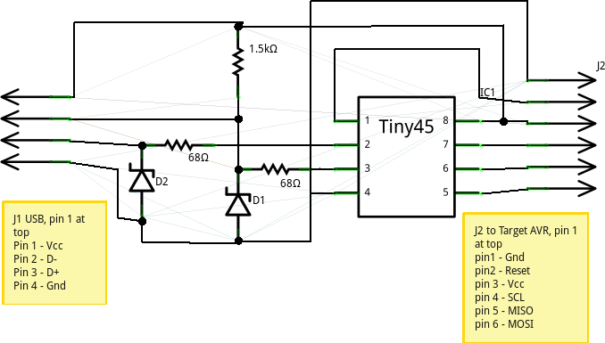
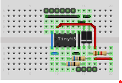
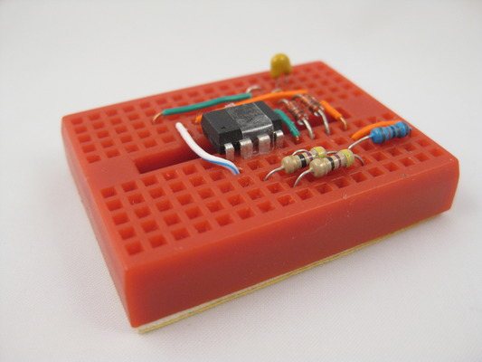
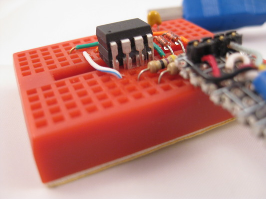
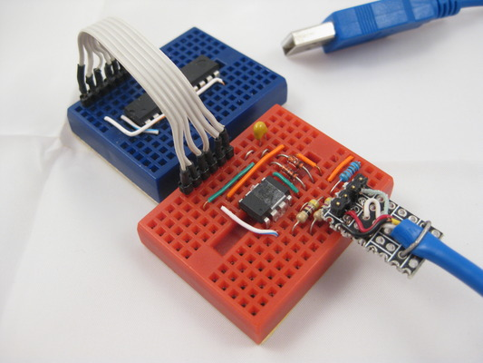
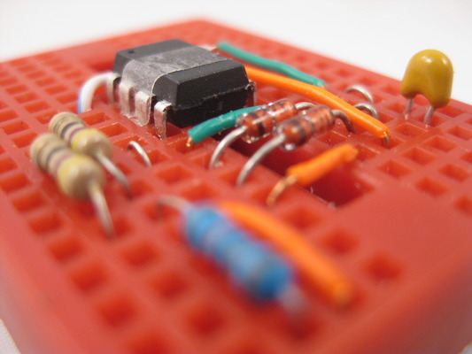

## vusbtiny programmer


`[November, 2010]` Initial write-up.

**Simple and Tiny AVR Device Programmer.**


<iframe width="560" height="315" src="https://www.youtube.com/embed/8904YO5c_po" frameborder="0" allow="autoplay; encrypted-media" allowfullscreen></iframe>
<br><br>

 


### Description


After making a usbtiny isp programmer and using it for 6 months, I was looking at making another one for carrying around. I like the simplicy of the usbtiny isp design but would like to make it even smaller and take less parts. One thing in the original design that i want to change is to eliminate the use of clock crystal. One solution i found is that v-usb drivers supports the 16.5Mhz internal oscillator on attiny25/45/85 devices. so i start out this project to have usbtiny isp employs v-usb for usb communication. the immediate benefits is that it saves space and have less component counts (no more crystals).


### Usbtiny


Description from [http://www.xs4all.nl/~dicks/avr/usbtiny/](http://www.xs4all.nl/~dicks/avr/usbtiny/)


USBtiny is a software implementation of the USB low-speed protocol for the Atmel ATtiny microcontrollers. Of course, it will also work on the ATmega series. The software is written for an AVR clocked at 12 MHz. At this frequency, each bit on the USB bus takes 8 clock cycles, and with a lot of trickery, it is possible to decode and encode the USB waveforms by software. The USB driver needs approximately 1250 to 1350 bytes of flash space (excluding the optional identification strings), depending on the configuration and compiler version, and 46 bytes RAM (excluding stack space). The C interface consists of 3 to 5 functions, depending on the configuration. 


### VUSB


Description from [http://www.obdev.at/products/vusb/](http://www.obdev.at/products/vusb/)


V-USB is a software-only implementation of a low-speed USB device for Atmel's AVR microcontrollers, making it possible to build USB hardware with almost any AVR microcontroller, not requiring any additional chip.


### Features


- Programming logic from usbtiny isp, mature avr-dude support
- Small foot-print
- Minimal components
- Powers target device

Note that the io lines to the target mcus are not protected. you can add 1k-2k resistors to SCK and MOSI and protect against possible wrong connections


### References


Based on the works found at


v-usb from framework [http://www.obdev.at/vusb/](http://www.obdev.at/vusb/)

usbtiny isp [http://www.xs4all.nl/~dicks/avr/usbtiny/](http://www.xs4all.nl/~dicks/avr/usbtiny/)


### Parts list


- Attiny45/85 (85 is more easier to come by)
- 3.6v zener diodes (1n747,BZX79,..avoid 1W types)
- 68ohm resistor x 2
- 1.5K resistor
- Mini breadboard 170 tiepoints
- usb cable (dollar shop usb printer cable is fine)
- 1k/2k resistors for io lines protection (optional)


### Tools required


- A working avr programmer (yes, it's a catch22, we need one to make one)
- Working avr programming environment


### Application notes


- Vusbtiny works w/ avrdude and is viewed by avrdude as a usbtiny programmer
- Vusbtiny always power target chip via USB
- Jumper J2 connects programmer to target chip
- When connected and NOT in programming
- Target chip w/ target RESET line high
- Other target pins (MISO, MOSI, CLK) in hi-Z state
- During programming
- Turns target RESET line LOW
- MISO becomes input
- MOSI, CLK becomes output


### Schematic


 


### Breadboard layout


 


### Construction


- Follow breadboard layout, there ain't that may components, 3 resistors, 2 diodes, 1 cap, plus an 8 pin mcu.
- Get a dollar shop usb printer cable cut off the printer end, there will be 4 exposed wire, secure and make them into a 4 pin male header, we will use it to connect to the breadboard. consult schematic for layout and pin assignment (J1).
- Watch out for diode polarity.


### Building and Flashing The Project


The project was built in a linux ubuntu lucid box with avr-gcc toolchain. It is assumed you already have such an environment, or you can find out from the internet how to setup one up. Source codes are gnu gpl v2 licensed from inheritence.


The source code follows a convention recommended by v-usb, you can download the source package vusbtiny.tgz and untarred in into a project directory. Within your source directory, there is a main.c, which is my version of modified usbtiny programmer. And a usbdrv sub-directory, which contains the v-usb layer. Please observe licensing term from the above two projects when building this. My source on the programmer logic is based on Dick Streefland version and not the ladyada version (although they are almost the same).


~~Source can be download here~~

~~click to download vusbtiny.tgz~~


`[Dec 23rd, 2010]` Add compiled binaries

~~Firmware binaries can be download here~~

~~Click to download vusbtiny.hex~~

~~Click to download vusbtiny.ee.hex~~


- untar the source package into your working directory


```
   tar -zxvf vusbtiny.tgz
```

- Do cd vsubtiny, to change into vusbtiny working directory
- Ajust makefile for target device according to the chip you will be using. i.e. PROGRAMMER_MCU=t45 or t85
- Do a make
- Attach your favorite ISP programmer
- Modify makefile and change your avrdude parameters if needed. the stock one assumes USBTiny programmer. i.e. AVRDUDE_PROGRAMMERID=usbtiny
- Flash firmware via make install

After flashing firmware, we need to properly set the fuse, we are using pin 1 reset as io in this project

ppl clock used as required by v-usb layer for usb timing

Reset pin disabled as we need to use it as io


```
   avrdude -c usbtiny -p t45 -V -U lfuse:w:0xe1:m -U hfuse:w:0x5d:m -U efuse:w:0xff:m 
```

This setting disables further programming via 5V SPI as we need the RESET pin (pin1) for io. You will need access to a HVSP programmer to recover the fuse.


### vusbtiny Layout Done on Mini Breadboard


 


### Direct Flashing on Breadboard


If you are using vusbtiny to flash 8 pin AVR devices, you can just press your target device on top of the programmer device. The programmer had been designed so that the programming pins matches w/ targets. There is one trick though, you will need to isolate pin 2 and 3 on the programmer mcu, as they are the USB D+ and D- pins connecting to the PC. I use a cut of scotch tape to achieve this, you can see it on the photos. Show below is a tiny13v "riding" on the tiny45, ready to receive firmware.


 


### ISP flashing via jumper


To program a target circuit via ISP (in-system programming), you need an ISP cable. Here i am not using the standard 2x3 or 2x5 pin headers. Instead i am using a 1x6 jumper which is more breadboard friendly, you can make 2x3 or 2x5 pin header by mapping them to J2 as shown on the breadboard layout and schematics. The following photo shows an tiny2313 ready to get flashed via ISP.


 


### Troubleshooting


- Cannot flash the firmware? check your original programmer, might need to adjust timing via -B flag in avrdude. try to read chip 1st, may be a bad fuse, may be your chip need an external clock signal. you may need to fix your chip back to default 1st.
- Check connections
- If use different io pins, check code and connections
- You may substitute zener diodes w/ 500mw, 400mw types
- You may try reduce R3 value to 1.2K or less
- You are more likely to encounter avrdude timing problems, try -B flag of avrdude, have a shorter USB cable all helps

 


