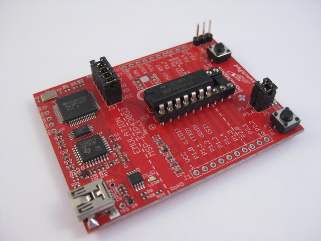
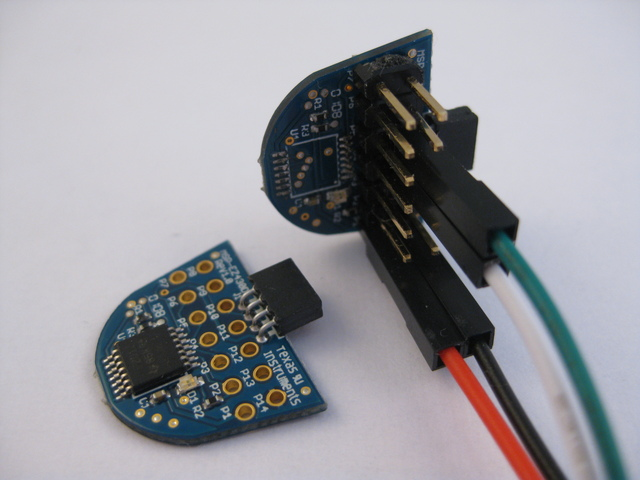
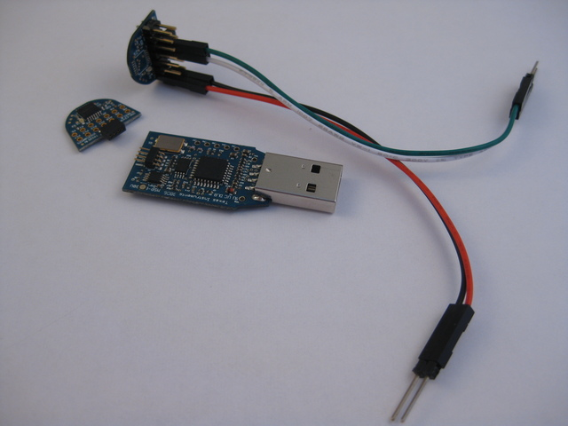
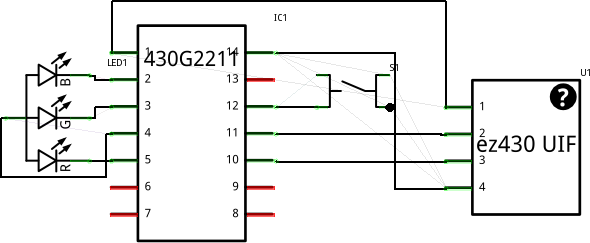
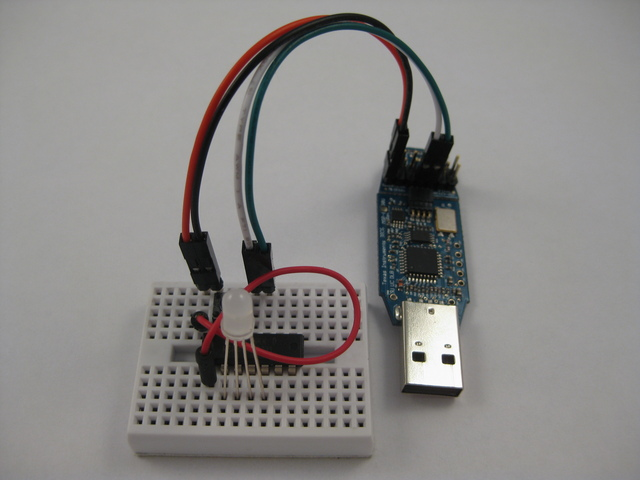

## TI LaunchBread


`[November, 2010]` Initial write-up.

`[April, 2015]` This page was created in 2010. Many things have changed. The procedures to setup a working environment is outdate and there are ways that is simpler and easier to setup the LP development environment under Linux.


**Breardboard Development and Programming with the TI msp430 Value Line MCUs.**


<iframe width="560" height="315" src="https://www.youtube.com/embed/BWRTcx5swME" frameborder="0" allow="autoplay; encrypted-media" allowfullscreen></iframe>
<br><br>

### Description


This is a tryout project based on the ti MSP430G2211. The project objective is to gain understanding on the basic io of this new mcu, tries out the toolchain under linux, etc.


The launchpad i got looks like this.


 


Ti launchpad info link [here](http://processors.wiki.ti.com/index.php/MSP430_LaunchPad_%28MSP-EXP430G2%29?DCMP=launchpad&HQS=Other+OT+launchpadwiki)


I acquired a ti lauchpad one week after it was launched. Since i work solely on a linux environment, it is natural to try and make it work under linix. ~~Unfortunately the launchpad has a different UIF firmware and mspdebug has not yet to support it~~ (as of july 7th). After combing through the datasheets it appears the mcu is very close to the F2013, in that they appears to share the same memory map and register layouts.


After visiting the losinggeneration site and trying, i realized that the launchpad had been working right out of the box with mspdebug all along, i was not able to get it working was due to usb driver problems. Still after connecting the launchpad, i can only run one mspdebug session. If i want to connect again i need to detach / re-attach launchpad. But the flash uploading, debugging via sbw all works fine now.


So i did the natural thing and create this "launchbread" (like breadboard arduino / breaduino) and use the ez430 usb dongle for programming and debuging.


In this setup i assembly the project w/ the extra G2211 mcu from the launchpad kit, i tried the G2231 and it works as well.


The ez430 doggle i got has the 4-pin 0.05in pitch connector and from studying the schematics we have;


- pin1 as VCC, (header P1)
- pin2 as SBWCLK, (header P11)
- pin3 as SBWTDIO, (header P10) RST
- pin4 as GND, (header P14)

We can directly hook this up on a breadboard setting. As the 0.05in pitched headers are hard to find, i sacrificed daughter F2012 board (3 for $10, i prey away the mcu and added 0.1in headers) so that i can have a solid 0.1in header connection. The provided header on the F2012 board has pin layout exactly as the targe G2xx device


The following shows an original F2012 daughter board and the one that had the MCU ripped off with 2x7 male header installed.


 


The whole hookup look like this with the EZ430-FET and jumper wires;


 


TI EZ430-F2013 info link [here](http://processors.wiki.ti.com/index.php?title=EZ430-F2013)


### Toolchain setup


My environment is ubuntu 10.04 lucid. We will need msp430-gcc4 and mspdebug. There is already a tutorial covering this which i had followed and worked well. ~~The mylightswitch.com tutorial can be found here~~


### Mspdebug Session


With the header / jumpers ready, i fired up mspdebug and got the followng;


```
chrisc@t61:~/ti/ez430/rgb> mspdebug -d /dev/ttyUSB0 uif
MSPDebug version 0.9 - debugging tool for MSP430 MCUs
Copyright (C) 2009, 2010 Daniel Beer <daniel@tortek.co.nz>
This is free software; see the source for copying conditions.  There is NO
warranty; not even for MERCHANTABILITY or FITNESS FOR A PARTICULAR PURPOSE.

Trying to open UIF on /dev/ttyUSB0...
Initializing FET...
FET protocol version is 10000000
Configured for Spy-Bi-Wire
Set Vcc: 3000 mV
Device: MSP430F20x1
Code memory starts at 0xf800
```

so afterall it is recognized as a MSP430F20x1 device. but does it programs? i then wrote a simple sketch (source code below) to try out basic ios and the timer. programming worked fine, step worked, run worked.


```
mspdebug -d /dev/ttyUSB0 uif "prog $PRG.elf"
.
.
.
Erasing...
Writing 128 bytes to f800...
Writing 128 bytes to f880...
Writing  48 bytes to f900...
Writing  32 bytes to ffe0...

(mspdebug) step
    ( PC: f804)  ( R4: 0ddf)  ( R8: 2fff)  (R12: 0005)  
    ( SP: 0280)  ( R5: ffde)  ( R9: 3f7f)  (R13: ffdf)  
    ( SR: 0000)  ( R6: f7fb)  (R10: 3efb)  (R14: 0001)  
    ( R3: 0000)  ( R7: fbf9)  (R11: efff)  (R15: 0000)  
    f804: b2 40 80 5a 20 01   MOV     #0x5a80,         &0x0120
    f80a: 3f 40 00 00         CLR     R15
    f80e: 0f 93               TST     R15
    f810: 05 24               JZ      0xf81c
    f812: 2f 83               DECD    R15
(mspdebug) run
Running. Press Ctrl+C to interrupt...

```

### RGB LED Source


- Use Timer to implement software pwm @ 25% duty (save resistors)
- Layout button and led so that i don't need jumpers (save jumpers)
- Press button to cycle thru the rgb combinations (8 of them)
- compensate individual color led brightness by turning them off at different rates (doesn't seem to work)


```
 //******************************************************************************
//  MSP430F20xx Demo - RGB LED
//
//  Description; RGB LED via P1.0-3, Tactile Button via P2.7
//  ACLK = n/a, MCLK = SMCLK = default DCO
//
//                MSP430F20xx
//             -----------------
//         /|\|              XIN|-
//          | |                 |
//          --|RST          P2.7|-->Button-->Gnd
//            |                 |
//            |             P1.0|-->LED-G
//            |             P1.1|-->LED-B
//            |             P1.2|-->LED-Common
//            |             P1.3|-->LED-R
//
//  CChung
//  Giftware, no license, no warranty
//  July 2010
//  Built with msp430-gcc, flash via mspdebug
//******************************************************************************


volatile unsigned int clicks=0;
volatile unsigned int ticks=0;
volatile unsigned int outp=0x00;

void main(void) {
    WDTCTL = WDTPW + WDTHOLD;                 // Stop WDT
    P1DIR |= 0x0f;                            // P1.0 output
    CCTL0 = CCIE;                             // CCR0 interrupt enabled
    CCR0 = 100;
    TACTL = TASSEL_2 + MC_1;                  // SMCLK, upmode

    P2SEL = 0x00;
    P2REN = 0xc0;

    unsigned int rgb=0x00;
    unsigned int button=0;

    _BIS_S`GIE`;
    while (1) {
        if (P2IN&0x80) {
            if (button > 5) {        // button released
                rgb++;
                outp = ((rgb&0x04)<<1) | rgb&0x03;
            }//if
            button = 0;
        }//if
        else {
            button++;
        }//else
    }//while
}

// Timer A0 interrupt service routine
interrupt(TIMERA0_VECTOR) Timer_A(void) {
    clicks++;
    if (clicks&0x03) {
        P1OUT = 0x00;
    }//if
    else {
        unsigned int usep = outp;
        //_________ trying to compsensate for individual color brightness
        if ((usep&0x08)&&!(ticks%3))  usep &= ~0x08;
        if ((usep&0x02)&&!(ticks%9))  usep &= ~0x02;
        if ((usep&0x01)&&!(ticks%5))  usep &= ~0x01;
        P1OUT = usep;
        ticks++;
    }//else
}
```

The above sketch is built with


```
/opt/msp430-gcc-4.4.3/bin/msp430-gcc -Os -mmcu=msp430x2012 -o rgb.elf rgb.c 
```

And uploaded with


```
mspdebug -d /dev/ttyUSB0 uif "prog rgb.elf"
```

### Breadboard Layout


 


If you run it off battery, make sure your RST line is connected to VCC


### Schematic


 


Note again the following pin mappings;

- Pin1 as VCC, (header P1)
- Pin2 as SBWCLK, (header P11)
- Pin3 as SBWTDIO, (header P10) RST
- Pin4 as GND, (header P14)


### Physical Hookup


 


aGain, if you run it off battery, make sure your RST line is connected to VCC


