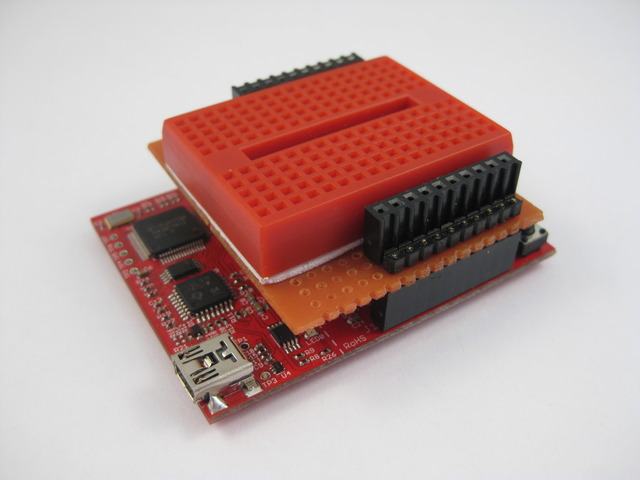
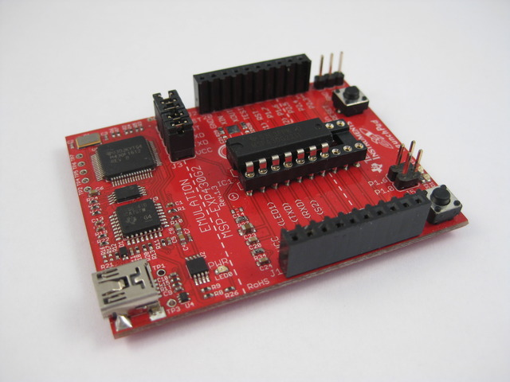
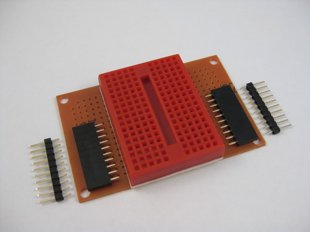
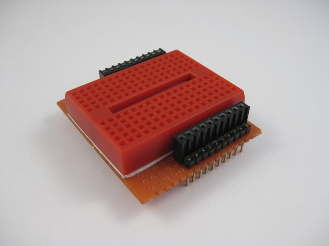
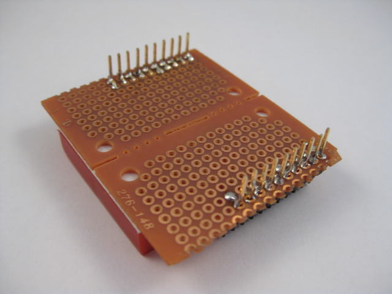
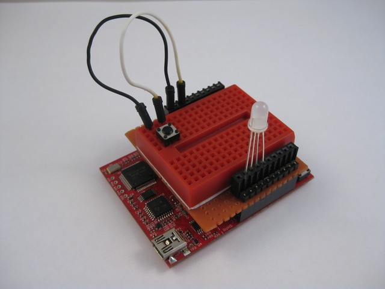

## LaunchPad Shield


`[November, 2010]` Initial write-up.

`[April 2015]` This page was created in 2010. Many things have changed. The procedures to setup a working environment is outdate and there are ways that is simpler and easier to setup the LP development environment under Linux.


**A DIY Breadboard Shield for the TI Launchpad, and RGB Led Driving Example.**


<iframe width="560" height="315" src="https://www.youtube.com/embed/NW8lBgM3Sqo" frameborder="0" allow="autoplay; encrypted-media" allowfullscreen></iframe>
<br><br>

 


### Description


- Homemade non-stackable breadboard shield based on prefboard and male / female headers
- Getting start w/ the TI LaunchPad under linux
- Hello-world RGB LED application.

The launchpad I got looks like this after I solder the female headers.


 


~~TI launchpad info link here~~


In order to start experimenting, we need more that the bare board, a breadboard shield would be nice for quick prototyping.


### DIY Breadboard Shield


This is what you will need to construct the breadboard shield

- 10 pin female headers x 2
- 10 pin male headers x 2
- A 170 tie-points mini breadboard
- A perfboard cut to size
- Access to soldering iron


 


The construction is rather self-explaining. You line up your headers based on the LaunchPad io layout and solder them together. You can use stackable female headers (w/ those long pins) but they are hard to find and expensive.

Some things to keep in mind;


- In my construction, I pushed down the male header pins to the edge of the blackc plastic housing and solder the connections on the underside of the shield.
- After inserting the female headers I use a flat head screwdriver to bend the pins down towards the male header pins for contact and soldering.
- You will want to layout the headers on the shield so that when you finish your shield does not cover up the LaunchPad and you can access the two tactile buttons on the LaunchPad w/ ease. i.e. place the headers on one edge, not the center of the shield.
- Check your connections w/ a multi-meter after soldering if you have messy hands / soldering iron

**Finished**


 


**And the underside**


 


### Toolchain Setup


My environment is ubuntu 10.04 lucid. We will need msp430-gcc4 and mspdebug. there is already a tutorial covering this which I had followed and worked well. the mylightswitch.com tutorial can be [found here](http://mylightswitch.com/2010/06/21/installing-mpsgcc4-and-mspdebug-on-kubuntu-1004/) basically you will need to download and install / build the following packages if they are not already in your system. Also note that you will need a more recent distro or you will have problem w/ the usb connection.


- subversion
- gcc-4.4
- texinfo
- patch
- libncurses5-dev
- zlibc
- zlib1g-dev
- libx11-dev
- libusb-dev
- libreadline6-dev

You will also need to install mspdebug as per instruction from the [above link](http://mylightswitch.com/2010/06/21/installing-mpsgcc4-and-mspdebug-on-kubuntu-1004)


### Mspdebug Session


With everything downloaded and installed properly, I ran mspdebug. Note that you need to specify it's a rf2500 device otherwise it won't work.


```
chris@chris-aao:~/ti/ez430/rgb$ 
chris@chris-aao:~/ti/ez430/rgb$ 
chris@chris-aao:~/ti/ez430/rgb$ mspdebug rf2500
MSPDebug version 0.9 - debugging tool for MSP430 MCUs
Copyright (C) 2009, 2010 Daniel Beer <daniel@tortek.co.nz>
This is free software; see the source for copying conditions.  There is NO
warranty; not even for MERCHANTABILITY or FITNESS FOR A PARTICULAR PURPOSE.

Trying to open interface 1 on 003
Initializing FET...
FET protocol version is 30066536
Configured for Spy-Bi-Wire
Set Vcc: 3000 mV
Device ID: 0xf201
Device: MSP430F2013
Code memory starts at 0xf800

Available commands:
    =        erase    hexout   mw       read     run      sym      
    cgraph   gdb      isearch  opt      regs     set      
    dis      help     md       prog     reset    step     

Available options:
    color     gdb_loop  

Press Ctrl+D to quit.

(mspdebug) 

```

### Workspace Directory Layout


I had organized my workspace in a very simple manner


```
~/ti                            for ti projects
~/ti/ez430                      for ez430 projects (or may be '~/ti/launchpad'?)
~/ti/ez430/project_name         for containing individual projects
```

Under ~/ti/ez430 I had two shell scripts to help me build and upload sketches. They are not makefiles but handy for simple experimenting. Both scripts should be under ~/ti/ez430 and be executables via 'chmod ugo+x a b'


Content of file 'a' used to compile


```
GCCBIN=/opt/msp430-gcc-4.4.3/bin
PRG=$1
if [ -z $PRG ]; then
PWD=`pwd`
PRG=`basename $PWD`
fi

$GCCBIN/msp430-gcc -Os -mmcu=msp430x2012 -o $PRG.elf $PRG.c
$GCCBIN/msp430-objdump -DS $PRG.elf > $PRG.lst
$GCCBIN/msp430-objdump -h $PRG.elf
$GCCBIN/msp430-size $PRG.elf

content of file 'b' for firmware upload
PRG=$1
if [ -z $PRG ]; then
PWD=`pwd`
PRG=`basename $PWD`
fi

mspdebug rf2500 "prog $PRG.elf"


```

To create a new project, you create a new directory under ~/ti/ez430, and create your one single C source file there. The C source file must be the same name as the directory. I.e. ~/ti/ez430/color_picker/color_picker.c. To compile just enter '../a' and to upload use '../b'


```
cd ~/ti/ez430
chris@chris-aao:~/ti/ez430$ mkdir rgb
chris@chris-aao:~/ti/ez430$ cd rgb
chris@chris-aao:~/ti/ez430/rgb$ vi rgb.c                (or your editor of choice)
                                                        (cut and paste some example code?)
chris@chris-aao:~/ti/ez430/rgb$ ../a                    (compile)

rgb.elf:     file format elf32-msp430

Sections:
Idx Name          Size      VMA       LMA       File off  Algn
  0 .text         00000130  0000f800  0000f800  00000094  2**1
                  CONTENTS, ALLOC, LOAD, READONLY, CODE
  1 .bss          00000006  00000200  00000200  00000094  2**0
                  ALLOC
  2 .vectors      00000020  0000ffe0  0000ffe0  000001c4  2**0
                  CONTENTS, ALLOC, LOAD, READONLY, CODE
   text       data        bss        dec        hex    filename
    336          0          6        342        156    rgb.elf

chris@chris-aao:~/ti/ez430/rgb$ ../b                    (upload firmware)

MSPDebug version 0.9 - debugging tool for MSP430 MCUs
Copyright (C) 2009, 2010 Daniel Beer <daniel@tortek.co.nz>
This is free software; see the source for copying conditions.  There is NO
warranty; not even for MERCHANTABILITY or FITNESS FOR A PARTICULAR PURPOSE.

Trying to open interface 1 on 004
Initializing FET...
FET protocol version is 30066536
Configured for Spy-Bi-Wire
Set Vcc: 3000 mV
Device ID: 0xf201
Device: MSP430F2013
Code memory starts at 0xf800
Erasing...
Writing 128 bytes to f800...
Writing 128 bytes to f880...
Writing  48 bytes to f900...
Writing  32 bytes to ffe0...
chris@chris-aao:~/ti/ez430/rgb$ 
```

### RGB Source


- Use timer to implement software pwm @ 25% duty (save resistors).
- Layout button and led so that i don't need jumpers (save jumpers).
- Press button to cycle thru the rgb combinations (8 of them).
- Compensate individual color led brightness by turning them off at different rates (doesn't seem to work).
- Cloned from misc. ti examples and modified.


```
//******************************************************************************
//  MSP430F20xx Demo - RGB LED
//
//  Description; RGB LED via P1.0-3, Tactile Button via P2.7
//  ACLK = n/a, MCLK = SMCLK = default DCO
//
//                MSP430F20xx
//             -----------------
//         /|\|              XIN|-
//          | |                 |
//          --|RST          P2.7|-->Button-->Gnd
//            |                 |
//            |             P1.0|-->LED-G
//            |             P1.1|-->LED-B
//            |             P1.2|-->LED-Common
//            |             P1.3|-->LED-R
//
//  CChung
//  Giftware, no license, no warranty
//  July 2010
//  Built with msp430-gcc, flash via mspdebug
//******************************************************************************


volatile unsigned int clicks=0;
volatile unsigned int ticks=0;
volatile unsigned int outp=0x00;

void main(void) {
    WDTCTL = WDTPW + WDTHOLD;                 // Stop WDT
    P1DIR |= 0x0f;                            // P1.0 output
    CCTL0 = CCIE;                             // CCR0 interrupt enabled
    CCR0 = 100;
    TACTL = TASSEL_2 + MC_1;                  // SMCLK, upmode

    P2SEL = 0x00;
    P2REN = 0xc0;

    unsigned int rgb=0x00;
    unsigned int button=0;

    _BIS_S`GIE`;
    while (1) {
        if (P2IN&0x80) {
            if (button > 5) {        // button released
                rgb++;
                outp = ((rgb&0x04)<<1) | rgb&0x03;
            }//if
            button = 0;
        }//if
        else {
            button++;
        }//else
    }//while
}

// Timer A0 interrupt service routine
interrupt(TIMERA0_VECTOR) Timer_A(void) {
    clicks++;
    if (clicks&0x03) {
        P1OUT = 0x00;
    }//if
    else {
        unsigned int usep = outp;
        //_________ trying to compsensate for individual color brightness
        if ((usep&0x08)&&!(ticks%3))  usep &= ~0x08;
        if ((usep&0x02)&&!(ticks%9))  usep &= ~0x02;
        if ((usep&0x01)&&!(ticks%5))  usep &= ~0x01;
        P1OUT = usep;
        ticks++;
    }//else
}

```

### Converting CCS Examples For GCC


If you download examples from ti and try to build them, you will get errors caused by different header files, macros, etc. Most simple examples can be converted easily so that gcc can build them. the most noticable problem is how the interrupt handlers are writtened.


In CCS they are as such


```
pragma vector=PORT1_VECTOR
__interrupt void PORT1_ISR (void)
```

And you need to change them to this, plus adding one header file


```
 #include "signal.h"
.
.
interrupt (PORT1_VECTOR) PORT1_ISR (void)

```

There may be other macros missing in gcc in more complex examples, you will need to find or create substitutes for them.


Here is a perl script I used to (try) convert the CCS examples from ti, it assumes that there is a ~/ti/ez430/CCS directory containing the ti examples. It will convert them and place them in ~/ti/ez430 where you can copy them as a base plate for your won projects. You can cut and paste it as ~/ti/ez430/ccs2gcc.pl.


Link to ti examples slac080h. Note that my script does not work on some of the more complex examples and you need to change them manually.


**ccs2gcc.pl**


```

use strict;
my $GCCBIN="/opt/msp430-gcc-4.4.3/bin";

for (`ls CCS/msp430x20x3*.c`) {
    chomp;
    print "$_";
    print "\n";
    open I, "<$_" and do {
        my $outfile = $_;
        $outfile =~ s/CCS\/msp430x20//;
        my $vector;
        open O, ">$outfile" and do {
                chomp;
                /^#include/ and print O "#include \"signal.h\"\n";
                /^#pragma\s+vector\s*=\s*(\w+)/ and do { $vector = $1; next; };
                /^__interrupt\s+void\s*(\w+)\s*\(void\)/ and $_ = "interrupt($vector) $1(void)";
                print O "$_\n";
            }
            close O;
        };
        close I;
    };
}
```

### Physical Hookup


With example project parts

 


